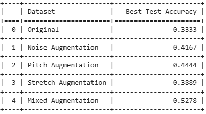
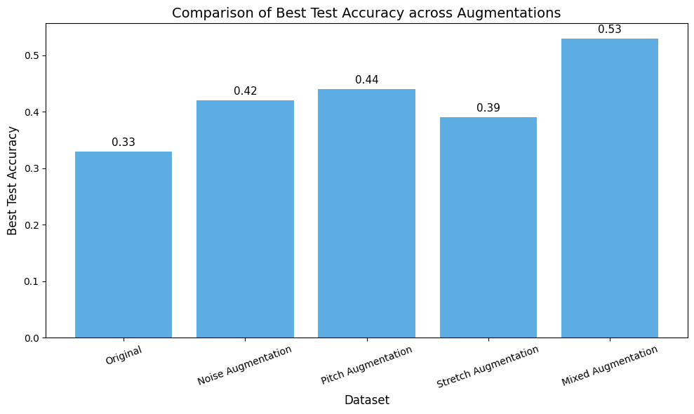
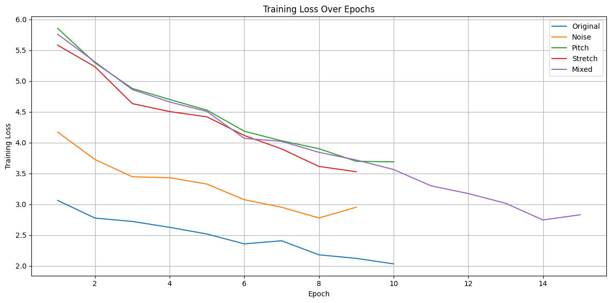

# Collecting-audio-data-from-video-and-comparing-data-augmentation-methods-(Persian-audio-data)

## 📌 Overview

This project explores how to collect and process voice segments from Persian-language films, and how different audio data augmentation methods impact the performance of emotion classification models.

Our goal is to test and compare augmentation techniques such as:
- Adding background noise
- Pitch shifting
- Time stretching
- Random mixed augmentation

We use Mel Spectrograms as the visual representation of audio, and train CNN-based models for emotion classification.

## 🎯 Objectives

- Extract dialogue audio from Persian movie
- Split speech into segments using silence detection
- Manually label the emotional tone of segments into 4 classes:
  - 0: Neutral
  - 1: Happy
  - 2: Sad
  - 3: Angry
- Apply various audio augmentation methods
- Generate Mel Spectrograms from each version
- Train and evaluate CNN models (e.g., ResNet18)
- Visualize results using accuracy plots and confusion matrices


## 🛠️ Installation

To run this project locally:

1. Clone the repository:
   ```bash
   git clone https://github.com/masume-r/Collecting-audio-data-from-video-and-comparing-data-augmentation-methods-Persian-audio-data-.git
   cd comparing-data-augmentation-methods
   pip install -r requirements.txt


## 🗂️ Project Structure
comparing-data-augmentation-methods/ ├── notebooks/ # All Jupyter notebooks for each step │ ├──
 01_data_collection.ipynb │ ├── 02_silence_segmentation.ipynb │ ├── 03_create_csv_from_segments.ipynb │ ├── 04_clean_and_balance_labeled_data.ipynb │ ├── 05_split_final_data.ipynb │ ├── 06_data_augmentation_final_fixed.ipynb │ ├── 07_generate_melspectrogram.ipynb │ ├── 08_prepare_augmented_csvs.ipynb │ ├── 09_prepare_test_data.ipynb │ ├── 10_Train_a_Model_(ResNet18_Fine_Tuning).ipynb │ ├── 11_Train_a_Model_(ResNet18_Fine_Tuning)Noise_aug.ipynb │ ├──  12_Train_a_Model(ResNet18_Fine_Tuning)pitch_aug.ipynb │ ├── 13_Train_a_Model(ResNet18_Fine_Tuning)stretched_aug.ipynb │ ├── 14_Train_a_Model(ResNet18_Fine_Tuning)_Mixed_Augmentation.ipynb │ └── visualization.ipynb ├── requirements.txt # List of required Python packages ├── README.md # Project documentation (this file)


 
---

## 🛠️ Main Dependencies

- Python 3.8+
- PyTorch
- torchvision
- torchaudio
- librosa
- matplotlib
- seaborn
- scikit-learn
- pandas
- numpy


## 📊 Results Overview

- Evaluated the effect of four different audio augmentation methods on emotion classification.
- Trained models using fine-tuned ResNet18 architecture.
- Visualized performance through confusion matrices and accuracy plots.
- Mixed augmentation showed slightly better generalization than individual methods.

Evaluated each augmentation method by training a ResNet-18 model on the augmented datasets and measuring its best test accuracy. The comparison results are presented below.

### 📋 Accuracy Table



### 📈 Accuracy Comparison (Bar Chart)

This bar chart shows the best test accuracy achieved by each augmentation strategy:



### 📉 Training Loss Over Epochs

This line chart visualizes how the training loss decreased over epochs for each version of the dataset:



---

## 📄 License

This project is licensed under the [MIT License](LICENSE).

---

## 🤝 Contributing

Contributions are welcome!  
Feel free to open issues, create pull requests, or suggest improvements to make this project better. Although this project was conducted using Persian-language audio data, the entire pipeline is language-independent and can be applied to any language or speech dataset with minimal adjustments.

---

## ✨ Acknowledgements

- Special thanks to the open-source community and libraries such as PyTorch, torchvision, torchaudio, librosa, and scikit-learn.


## 📌 기술 평가 항목 대응 내역

- **[1. 데이터사이언스 공통]**  
  Python을 기반으로 데이터 처리, 오디오 분할, 라벨링, 모델 학습 등 전체 파이프라인을 직접 구현하였습니다.

- **[3. 데이터 수집 및 정제]**  
  영화에서 오디오를 추출하고, 무음 감지를 통해 발화 단위로 분리하였습니다.  
  .wav 데이터를 전처리하고, Mel Spectrogram으로 변환하여 모델 입력으로 활용하였습니다.

- **[4. 수집한 데이터셋의 유용성]**  
  직접 감정 라벨링을 수행하여 4가지 감정 클래스로 분류하였고,  
  데이터를 CSV 파일로 저장 및 정제하여 모델 훈련에 활용 가능한 형태로 구성하였습니다.

- **[7. 데이터 활용 및 분석]**  
  PyTorch와 torchvision을 사용하여 Mel Spectrogram 기반 ResNet18 모델을 학습하였고,  
  감정 분류 성능 비교를 위해 4가지 오디오 데이터 증강 기법  
  (**배경 소음 추가, 피치 변조, 속도 조절, 혼합 증강**)을 적용하여 파인튜닝 실험을 수행하였습니다.

- **[8. 데이터 시각화]**  
  증강 기법별 정확도 비교, 혼동 행렬, 학습 손실 그래프 등을 시각화하여 모델 성능을 분석하였습니다.


